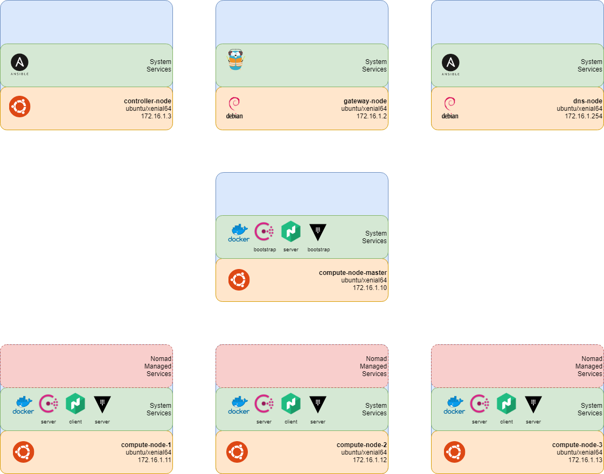

# Home Cloud Native Platform

## Project Description

This projects provides infrastucture-as-code to [Ansible](https://www.ansible.com/) scripts to automate the provisioning of a network of virtual nodes or hardware nodes with a development cluster utilising the Hashicorp Consul, Vault and Nomad stack, Docker and Traefik, as a foundation to support hosting of containerised services. The stack is both horizontally and vertically scalable having been tested on ARM based Raspberry Pi (versions 2 and 3) as well as Intel 64 systems.

The following core services are installed on each node:

* [Docker](https://www.docker.com/) for running containerised services.
* [Hashicorp Consul](https://www.consul.io/) for service registration and discovery.
* [Hashicorp Vault](https://www.hashicorp.com/products/vault/) for managing secrets.
* [Hashicorp Nomad](https://www.hashicorp.com/products/nomad) for orchestrating services.
* [Traefik](https://traefik.io/) as a reverse proxy and gateway.

The default topology of the cluster is as shown in the following figure.



## Deployment

### Using Vagrant

Vagrant will provision virtual machines. On one, Ansible will be installed and the playbook [`self-hosted-registry-repository.yml`](ansible/self-hosted-registry-repository.yml) run to install the services on the other host. Configurations for both VirtualBox and Azure are included as providers.

[Vagrant](https://www.vagrantup.com/) must also be installed on the host machine following the instructions at https://www.vagrantup.com/intro/getting-started/index.html. Using Vagrant enables the project to be run on Linux, Mac OS and Windows based hosts.

#### VirtualBox

To utilise [VirtualBox](https://www.virtualbox.org) as the provider so is required to be install on the host machine following the instructions at https://www.virtualbox.org/wiki/Downloads. To deploy the service, run the following command from within the project directory:

```bash
vagrant up
```

#### Azure

Requires the Vagrant Azure plugin from https://github.com/Azure/vagrant-azure. [Install the plugin](https://www.vagrantup.com/docs/plugins/usage.html) using

```bash
vagrant plugin install vagrant-azure
```

To deploy the service, run the following command from within the project directory:

```bash
 vagrant box add azure https://github.com/azure/vagrant-azure/raw/v2.0/dummy.box --provider azure
$ vagrant plugin install vagrant-azure
$ vagrant up --provider=azure
```

### Using Physical Nodes

Create an ssh key using [`scripts/create_keys.sh`](scripts/create_keys.sh) and copy is across to the nodes using [`scripts/copy_keys.sh`](scripts/copy_keys.sh).

Ensure Ansible is installed on the controller using [`scripts/install_ansible.sh`](scripts/install_ansible.sh).

Copy the example [Ansible Inventory](https://docs.ansible.com/ansible/latest/user_guide/intro_inventory.html), [`ansible/hosts-example.yml`](ansible/hosts.yml), to `ansible/hosts.yml` and configure with the IP addresses of the nodes. to suit the network. Check the nodes specified within the inventory file using [`ansible/ansible-list-all-nodes.sh`](ansible/ansible-list-all-nodes.sh). Test the connection to the nodes using [`ansible/ansible-ping-all-nodes.sh`](ansible/ansible-ping-all-nodes.sh). Get the facts about a node using [`ansible/ansible-get-facts.sh`](ansible/ansible-get-facts.sh).

Create an [Ansible Playbook](https://docs.ansible.com/ansible/latest/user_guide/playbooks.html) to run required roles on specified hosts. Test the playbook syntax using [`ansible/ansible-check-playbook-syntax.sh`](ansible/ansible-check-playbook-syntax.sh). Run the Ansible playbook using [`ansible/ansible-run-play.sh`](ansible/ansible-run-play.sh).

[Ansible](https://www.ansible.com/) is required to be installed on the host that scripts are being run from. Ensure the inventory file [`hosts.yml`](ansible/hosts.yml) is correctly configured. Run the playbook using

```bash
cd ansible
./run-ansible-play.sh
```
