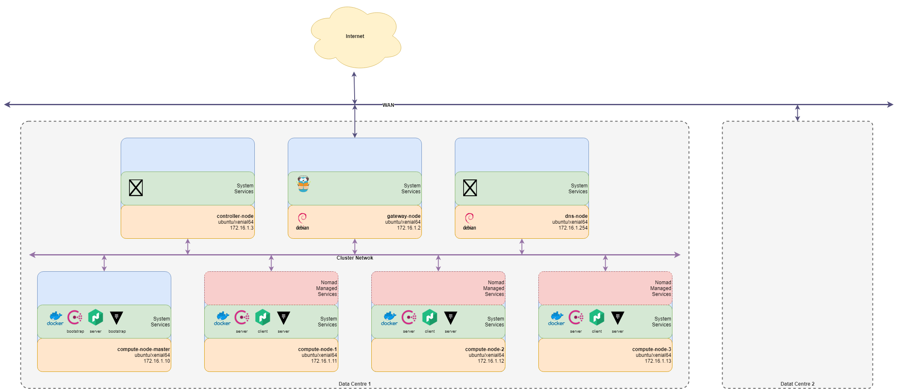

# Sherpa - The Home Cloud Native Platform

## Project Description

The Sherpa project provides infrastucture-as-code to automate the provisioning of a cluster of virtual, or hardware, nodes as a self-contained data centre into which services can be deployedad distrubuted across the nodes within the data centre. Deploying services on to nodes provisioned by Sherpa lightedn the load of having to manage the deployment and interaction between teh services.

## Objectives

After looking into exisitng capabilies, two sets of solutions:
1. Single solutions, such as JKerbernetes, whcih offer limited scalability towrard the edge, and are tied to a specific service deployment technology, such as Docker
2. Specialist services whcich proide a certain capaibity but need to be deployed and configuured to work togehter to achieve the overall capability.
 
The rashonale for developing and maintaining such 

The primary objectives of Sherpa:

* is to provide a technology stack which is both horizontally and vertically scalable, 
* reuse solutions as much as posible
* have a low entry point to utilise, and 
* allows a data centre to be moved between networks, or removed from an external network and still maintain functionality. 
Why needed. Scale. Do not want to be tied to specific technology (no lock-in), only Docker containers. Utilise existing technology. Configuration and architexture across multiple infrastructure types. 

 from the end user,  having been tested on ARM based Raspberry Pi (versions 2 and 3) as well as Intel 64 systems.

The following core services are installed on each node:

* [Hashicorp Consul](https://www.consul.io/) for service registration and discovery.
* [Hashicorp Nomad](https://www.hashicorp.com/products/nomad) for orchestrating services.
* [Hashicorp Vault](https://www.hashicorp.com/products/vault/) for managing secrets.
* [Traefik](https://traefik.io/) as a reverse proxy and gateway.
* [Docker](https://www.docker.com/) for running containerised services.

as [Ansible](https://www.ansible.com/) script into which services can be deployed. Ansible Galaxy scipts utilised for deployment of services, focus of Sherpa is therefore on the configuration of the services across the nodes to provide the overall capability.

The default topology of the cluster is as shown in the following figure.



## Deployment

### Using Vagrant

The project is designed to be deployed using various methods to support different environments. The easiest approach is to utilise the provided Vagrant deployment files which include settings to provision Virtual Machines on [VirtualBox](https://www.virtualbox.org) or [Azure](https://azure.com). The project, however, can also be installed on existing host systems directly via [Ansible](https://www.ansible.com). 

### Deployment via Vagrant

To utilise Vagrant it must first be installed on the host machine following the instructions at https://www.vagrantup.com/intro/getting-started/index.html.  Using Vagrant makes it easier to maintain an installation process which can be run on Linux, Mac OS and Windows based hosts, via VirtualBox, as well as Cloud-based infrastructure, such as Azure.

By default, when using Vagrant, Vagrant will provision six virtual machines. On one, the controller, Ansible will be installed. Ansible is then used to provision the services on the other machines, as defined in the figutre above, via the script [site.yml](ansible/site.yml).

#### Using VirtualBox

In order to use VirtualBox as the provider it must be installed on the host machine following the instructions at https://www.virtualbox.org/wiki/Downloads. Once installed, to deploy the services, run the following command from within the project directory:

```bash
vagrant up
```

#### Using Azure

To use Azure an account is required, details of which neeed to be set as environment variables on the host machine Vagrant is being run from. See the instructions at to configure the variables.

In addition, to use Azure as a provider for Vagrant, the Azure plugin needs to be installed. Run the following, from the project directory, to install the plugin and deploy the services:

```bash
vagrant box add azure https://github.com/azure/vagrant-azure/raw/v2.0/dummy.box --provider=azure
vagrant plugin install vagrant-azure
vagrant up --provider=azure
```

### Using pre-built hosts

To install on pre-built hosts, Ansible can be installed and used directly. An Ansible inventory file must be created, however, whcih includes the details of the hardware being employed. An example inventory file, [hosts-example.yml](ansible/hosts-exmaple.yml), is included which can be copied to a file called `hosts.yml`, in the ansible directory, as a starting point. In addition, an ssh key must be copied to each node. The scripts, [create_keys.sh](scripts/create_keys.sh) and [copy_keys.sh](scripts/copy_keys.sh), are provided to support this. Copy the example [Ansible Inventory](https://docs.ansible.com/ansible/latest/user_guide/intro_inventory.html), [`ansible/hosts-example.yml`](ansible/hosts.yml), to `ansible/hosts.yml` and configure with the IP addresses of the nodes. to suit the network. Check the nodes specified within the inventory file using [`ansible/ansible-list-all-nodes.sh`](ansible/ansible-list-all-nodes.sh). Test the connection to the nodes using [`ansible/ansible-ping-all-nodes.sh`](ansible/ansible-ping-all-nodes.sh). Get the facts about a node using [`ansible/ansible-get-facts.sh`](ansible/ansible-get-facts.sh).

The deployment of the services can then be undertaken using:

```bash
cd ansible
./run-ansible-play.sh -b
```

and selecting the default command line arguments.
